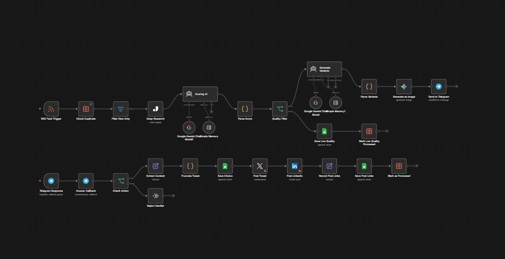

# 📰 DeepPublish AI: Автономный движок контент-операций

   

Это технический хаб документации экосистемы **DeepPublish AI** — n8n-воркфлоу промышленного уровня, разработанный для превращения потоков сырых новостей в высокоавторитетное присутствие в социальных сетях.

---

### 🛠 Обзор архитектуры

> **Контент-революция**
> Перестаньте тратить часы на ручную модерацию. DeepPublish AI работает как автономный ньюсрум, который исследует, фильтрует и готовит посты для ваших соцсетей, пока вы спите.

---

### 🧠 Системный интеллект

* **Глубокий анализ (Deep Research):** Интеграция с **Jina AI** для парсинга и анализа полного контекста статей, гарантирующая, что ваш контент будет глубоким, а не поверхностным.
* **Умный скоринг:** Двухуровневая фильтрация через **Gemini Pro и GPT-4** для отбора только 10/10 релевантных инфоповодов под вашу конкретную нишу.
* **Синхронизация с платформами:** Единая система утверждения для публикации идеально отформатированных постов во **𝕏 (Twitter), LinkedIn и Telegram** одновременно.
* **Защита от спама:** Встроенное обнаружение дубликатов и функция «умной задержки» (Smart Delay), чтобы ваши аккаунты были в безопасности и выглядели естественно.

---

### 🛠 Техническая архитектура
Система построена на модульной логике n8n, что обеспечивает высокую стабильность, обработку ошибок и легкое масштабирование:
* **Триггер:** RSS-ленты / Вебхуки / Запланированные парсеры
* **Обработка:** Расширенный JSON-партинг и суммаризация с помощью ИИ
* **Хранилище:** Простая интеграция с Google Таблицами или Supabase для ведения логов контента

---

### 🚀 Внедрение
Этот вокфлоу предоставляется в виде профессионального JSON-шаблона. Он включает в себя:
* ✅ **Предварительно настроенные узлы** для мгновенного развертывания.
* ✅ **Подробное руководство по настройке** интеграций с API.
* ✅ **Промпты**, оптимизированные для высокой вовлеченности в соцсетях.

---

### 🛒 Получить полный доступ
Превратите свои контент-операции в полностью автономный движок.

[**👉 Получить DeepPublish AI на Gumroad**](https://naroka.gumroad.com/l/deeppublish-ai)

---

## 🚀 Готовы делегировать рутину искусственному интеллекту?

Я разрабатываю **кастомные автоматизации и ИИ-ассистенты на базе n8n**, которые работают 24/7 и экономят десятки часов вашего времени. Я беру на себя весь процесс: от анализа ваших задач до внедрения готового решения «под ключ».

### Связаться со мной:

* 💬 **Telegram:** [t.me/nar00ka](https://t.me/nar00ka) — давайте обсудим вашу идею за 10 минут.
* 🐙 **GitHub:** https://github.com/nar0ka — изучите мои open-source проекты.
* 📦 **Gumroad:** https://naroka.gumroad.com — посмотрите готовые к использованию воркфлоу.
* 

> **💡 Бонус:** Если вы не уверены, с чего начать автоматизацию, просто напишите мне — я помогу определить, какие процессы можно оптимизировать уже сегодня!

---

*Разработано [Naroka Studio](https://github.com/Naroka-Studio)*
